<h1 align="center">Hi there 👋 welcome to my Github .</h1>
<h1 align="center">I'm Hà Huy Hùng</h1>

<h3 align="center">📘 Currently studying on TDTU</h3>
<h3 align="center">💻 Working on ... Technology & Photographer </h3>
<h3 align="center">✍️ Making some projects using JavaScript, PHP,...</h3>
<h3 align="center">:open_file_folder: Node.js, React.js, TensorFlow and Laravel </h3>

#### Languages and Frameworks I know and Study

<code></code>
<code></code>
<code></code>
<code></code>
<code></code>
<code></code>
<code></code>
 

#### My github stats

Facebook: <a href="https://www.facebook.com/zeroryo25/">Huy Hùng</a>

# Learn_English_Today
Ứng dụng học tiếng anh  trên Android được tạo bằng Flutter sử dụng các API Android như english_words,shared_preferences,... 
## Features
- Flutter UI: Giao diện người dùng và hình ảnh động nâng cao.
- english_words + quoctes : Gồm nhiều từ vựng với cách hiện thị sống động, có thể note lại từ vựng và tăng số từ
## Screenshots
| 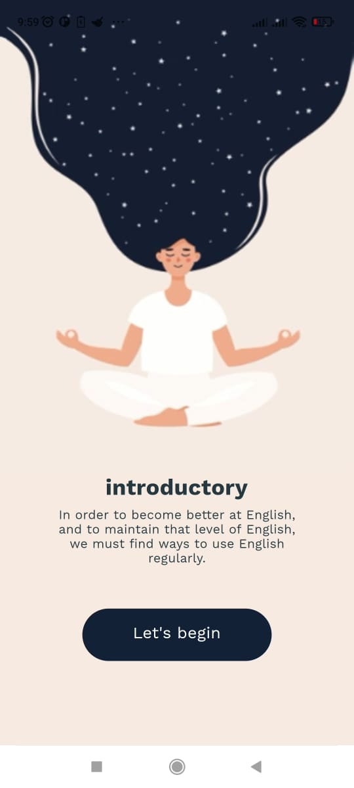 | 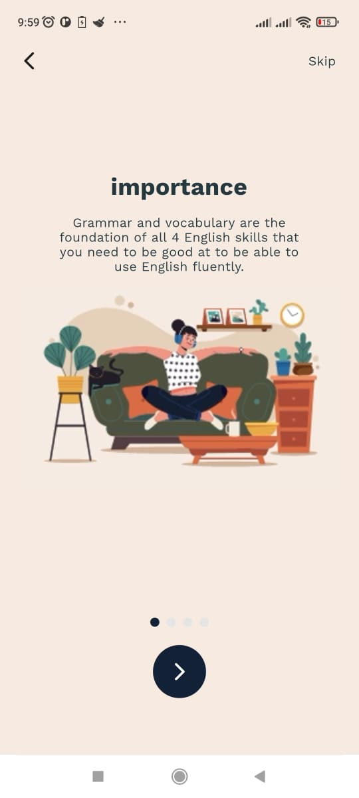 | 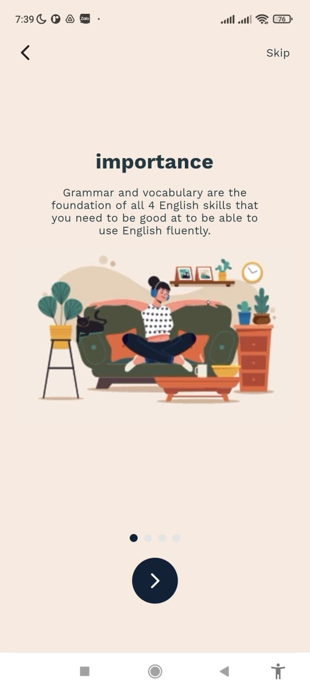 | 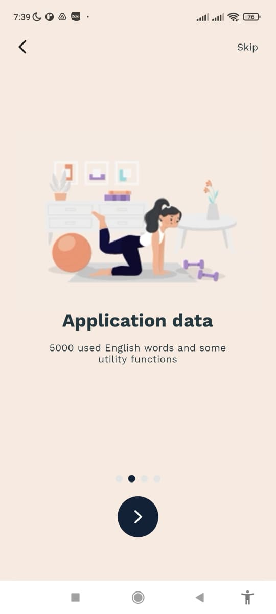 |
|----------|:-------------:|:-------------:|:-------------:|
| 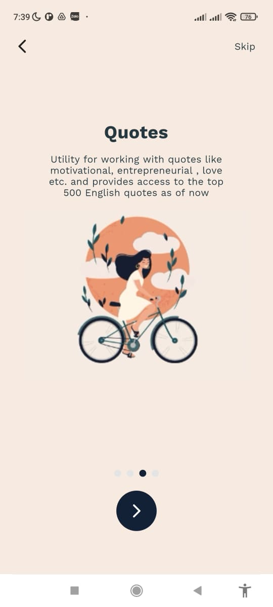 | 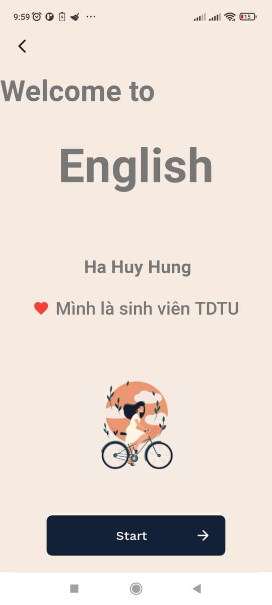 | 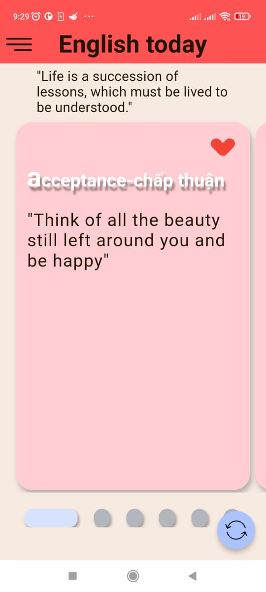 | 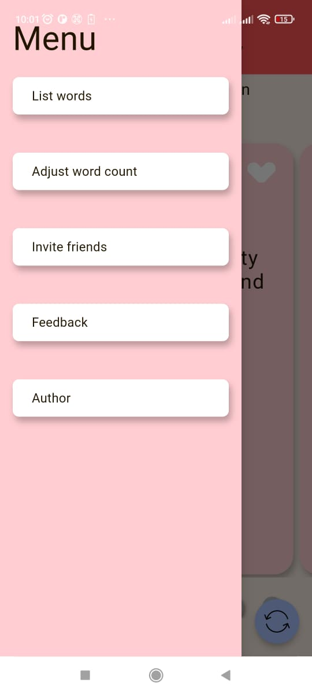 |
|----------|:-------------:|:-------------:|:-------------:|
| 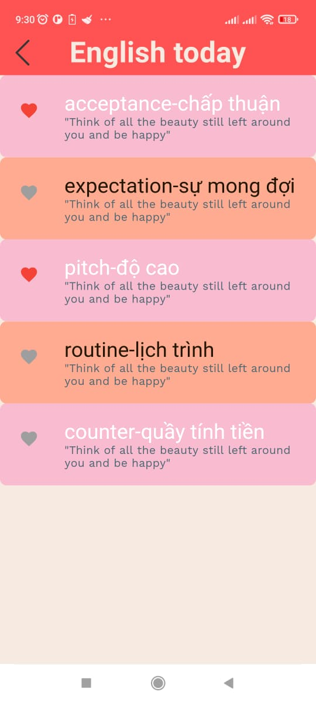 | 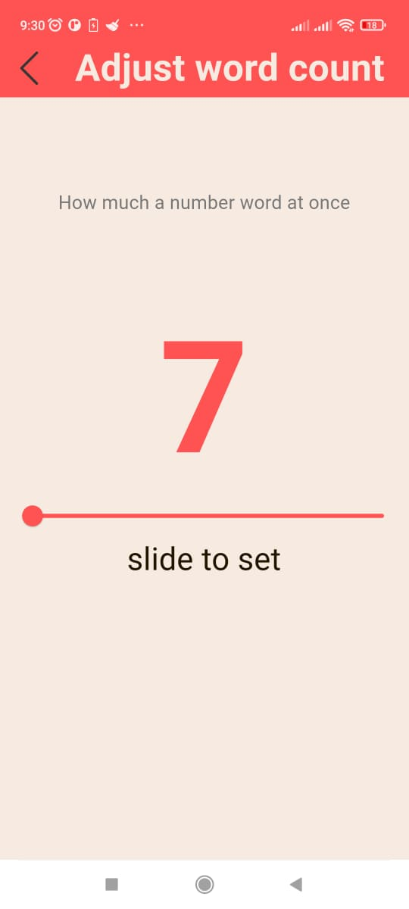 |  |  |
|----------|:-------------:|:-------------:|:-------------:|
| 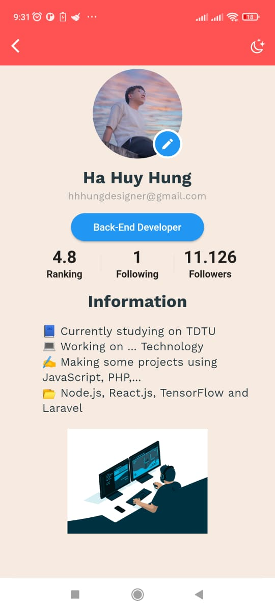  | 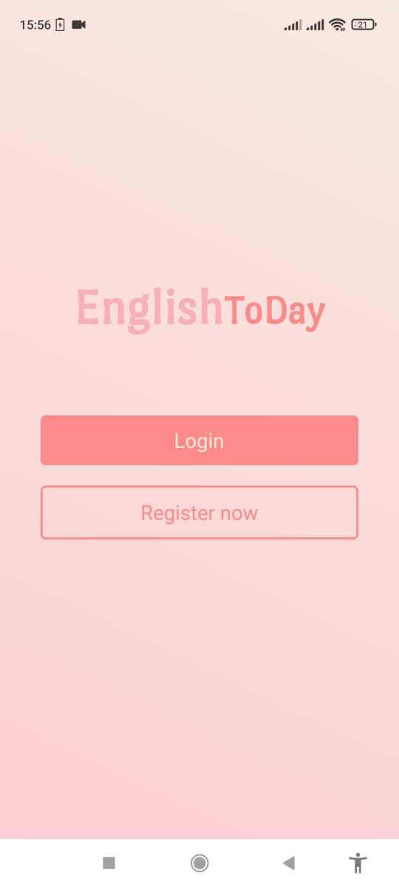 | 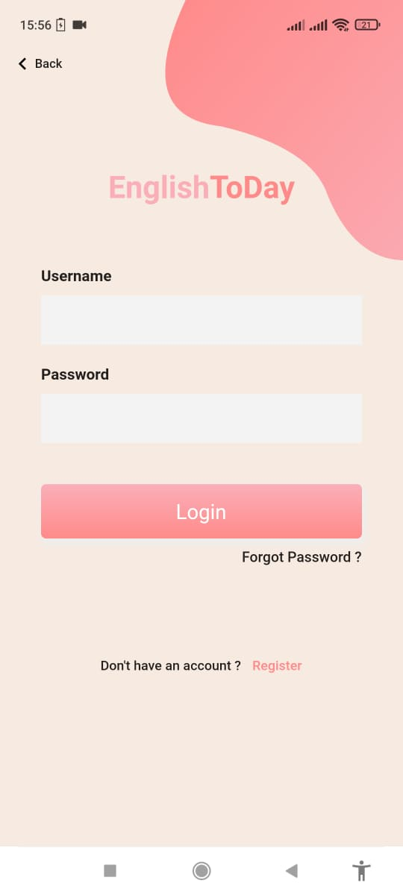 | 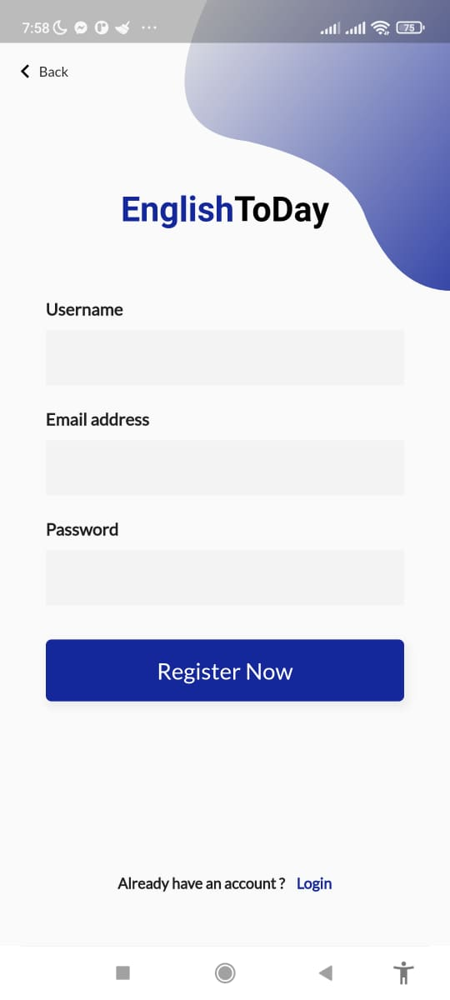 |
|----------|:-------------:|:-------------:|:-------------:|

